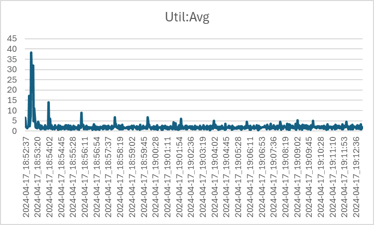

# Project Report #
## API service for a distributed data processing pipeline for biodiversity data aggregators ##


<p>
<span>Nitin Goyal</span></br>
<span>UFID - 87003630</span></br>
<span>nitin.goyal@ufl.edu</span></br>
<span>Electrical and Computer Engineering</span></br>
<span>University of Florida </span></br>
</p>
 
### a.	Results for window size of 2 minutes for total of 10 windows. ### 
 


### b.	CPU utilization vs time ###




### c.	Setup ###
Project’s setup contains 3 nodes on cloud lab connected with a local switch. 

- Node 1 serves as Spark master and Nodes 2 and 3 are the Spark workers. Kafka is implemented with Kraft.
- To generate the output the spark job runs a query over the processing time as trigger and a query timeout. 
- The API server has a self-signed SSL certificate and has a nginx reverse proxy to redirect requests from HTTPS default port (443) to the application port 12700.
- The query used for task 1 is different than the query for API in task 2. I have attached the source code for the project below.
- To measure the CPU utilization I used `sysstats` package on Linux, specifically I used - `sar -u 2 > cpu_utilization.txt` - this records the system statistics every 2 seconds in the cpu_utilization.txt file.

**Here is an overview of the project folder –**

```bash
/kafka
	Producer.py 		Wrapper around confluent_kafka producer class
	Consumer.py		Wrapper around confluent_kafka consumer class
	/kafka/runner
	Producer_main.py	streams data from input topic_name
	/schemas		contain schemas for 3 sources record objects.
	/scripts		contain bash scripts to setup environment on all three nodes and get the processes up and running.
	/spark 			contain jobs for task-1 and task-2 scripts
	/streams		stream files for given 3 sources. I used strategy pattern to select the stream function based on the topic name – `utils/stream_data.py`

	Api.py			python Flask api server.
	Requirements.txt	pip freeze export
```

### Project Code ###

```python
# /kafka/producer.py
# For configuring the producer, connecting the producer and 
# for running the producer
import sys
sys.path.append('/users/ngoyal')

from uuid import uuid4
import os
import json
from confluent_kafka import Producer
from confluent_kafka.serialization import StringSerializer
# from src.utils.interfaces.singleton import Singleton


class MyProducer():
    
    __producer = None
    string_serializer = StringSerializer('utf_8')
    
    def __init__(self, server_address = 'localhost:9092'):
        self.__producer = Producer({
            'bootstrap.servers': server_address
        })
    
    def delivery_callback(err, msg):
        if err is not None:
            print("Delivery failed for User record {}: {}".format(msg.key(), err))
            return
        print('User record {} successfully produced to {} [{}] at offset {}'.format(
            msg.key(), msg.topic(), msg.partition(), msg.offset()))
    
    def produce_topic(self, topic_name, data):
        # Serialize data dictionary to JSON string
        serialized_data = json.dumps(data)
        serialized_data_bytes = serialized_data.encode('utf-8')
        
        self.__producer.produce(topic_name, key=self.string_serializer(str(uuid4())), value=serialized_data_bytes, callback=self.delivery_callback)

        def stop_producer():
            self.__producer.stop()
        
        return stop_producer
```

```python
# kafka/runner/producer_main.py

import sys
sys.path.append('/users/ngoyal')
import argparse

from src.kafka.producer import MyProducer
from src.utils.stream_data import StreamDataStrategy

def stream_data_from_source(server, topic_name):
    kafka_producer = MyProducer(server)
    
    stream = StreamDataStrategy(topic_name).select_stream()
    
    try:
        for item in stream.start_stream():
            # Send the JSON data with topic name = topic_name to Kafka queue
            # print(item)
            kafka_producer.produce_topic(topic_name, item)
            
    except KeyboardInterrupt:
        sys.stderr.write('%% Aborted by user\n')
    except ValueError:
        print("Invalid input, discarding record...")
    
if __name__ == '__main__':
    parser = argparse.ArgumentParser(description='Process some data.')
    parser.add_argument('brokers', type=str, help='broker server addresses to use')
    parser.add_argument('topic', type=str, help='name of the kafka topic')
    
    args = parser.parse_args()
    
    print('Topic name: ', args.topic)
    print('Broker Address: ', args.brokers)
    stream_data_from_source(args.brokers, args.topic)
```

```python
# /schemas/

from pyspark.sql.types import StructType, StructField, StringType, IntegerType, DoubleType, BooleanType, ArrayType, MapType

# Define the schema for the JSON-like message
schema = StructType([
    StructField("key", IntegerType(), True),
    StructField("datasetKey", StringType(), True),
    StructField("publishingOrgKey", StringType(), True),
    StructField("installationKey", StringType(), True),
    StructField("hostingOrganizationKey", StringType(), True),
    StructField("publishingCountry", StringType(), True),
    StructField("protocol", StringType(), True),
    StructField("lastCrawled", StringType(), True),
    StructField("lastParsed", StringType(), True),
    StructField("crawlId", IntegerType(), True),
    StructField("extensions", MapType(StringType(), StringType()), True),
    StructField("basisOfRecord", StringType(), True),
    StructField("occurrenceStatus", StringType(), True),
    StructField("taxonKey", IntegerType(), True),
    StructField("kingdomKey", IntegerType(), True),
    StructField("phylumKey", IntegerType(), True),
    StructField("classKey", IntegerType(), True),
    StructField("orderKey", IntegerType(), True),
    StructField("familyKey", IntegerType(), True),
    StructField("genusKey", IntegerType(), True),
    StructField("speciesKey", IntegerType(), True),
    StructField("acceptedTaxonKey", IntegerType(), True),
    StructField("scientificName", StringType(), True),
    StructField("acceptedScientificName", StringType(), True),
    StructField("kingdom", StringType(), True),
    StructField("phylum", StringType(), True),
    StructField("order", StringType(), True),
    StructField("family", StringType(), True),
    StructField("genus", StringType(), True),
    StructField("species", StringType(), True),
    StructField("genericName", StringType(), True),
    StructField("specificEpithet", StringType(), True),
    StructField("taxonRank", StringType(), True),
    StructField("taxonomicStatus", StringType(), True),
    StructField("iucnRedListCategory", StringType(), True),
    StructField("decimalLatitude", DoubleType(), True),
    StructField("decimalLongitude", DoubleType(), True),
    StructField("elevation", DoubleType(), True),
    StructField("elevationAccuracy", DoubleType(), True),
    StructField("continent", StringType(), True),
    StructField("gadm", MapType(StringType(), StructType([
        StructField("gid", StringType(), True),
        StructField("name", StringType(), True)
    ])), True),
    StructField("year", IntegerType(), True),
    StructField("month", IntegerType(), True),
    StructField("day", IntegerType(), True),
    StructField("eventDate", StringType(), True),
    StructField("startDayOfYear", IntegerType(), True),
    StructField("endDayOfYear", IntegerType(), True),
    StructField("issues", ArrayType(StringType()), True),
    StructField("lastInterpreted", StringType(), True),
    StructField("license", StringType(), True),
    StructField("isSequenced", BooleanType(), True),
    StructField("identifiers", ArrayType(StructType([
        StructField("identifier", StringType(), True)
    ])), True),
    StructField("media", ArrayType(StringType()), True),
    StructField("facts", ArrayType(StringType()), True),
    StructField("relations", ArrayType(StringType()), True),
    StructField("isInCluster", BooleanType(), True),
    StructField("datasetID", StringType(), True),
    StructField("recordedBy", StringType(), True),
    StructField("identifiedBy", StringType(), True),
    StructField("geodeticDatum", StringType(), True),
    StructField("class", StringType(), True),
    StructField("countryCode", StringType(), True),
    StructField("recordedByIDs", ArrayType(StringType()), True),
    StructField("identifiedByIDs", ArrayType(StringType()), True),
    StructField("gbifRegion", StringType(), True),
    StructField("country", StringType(), True),
    StructField("publishedByGbifRegion", StringType(), True),
    StructField("identifier", StringType(), True),
    StructField("eventID", StringType(), True),
    StructField("http://unknown.org/language", StringType(), True),
    StructField("footprintWKT", StringType(), True),
    StructField("originalNameUsage", StringType(), True),
    StructField("municipality", StringType(), True),
    StructField("county", StringType(), True),
    StructField("identificationVerificationStatus", StringType(), True),
    StructField("nameAccordingTo", StringType(), True),
    StructField("gbifID", StringType(), True),
    StructField("occurrenceID", StringType(), True),
    StructField("taxonID", StringType(), True)
])

from pyspark.sql.types import StructType, StructField, StringType

# Define the schema for the JSON-like message
schema = StructType([
    StructField("dwc:startDayOfYear", StringType(), True),
    StructField("dc:language", StringType(), True),
    StructField("dwc:specificEpithet", StringType(), True),
    StructField("dwc:countryCode", StringType(), True),
    StructField("dwc:latestPeriodOrHighestSystem", StringType(), True),
    StructField("dc:type", StringType(), True),
    StructField("dwc:recordedBy", StringType(), True),
    StructField("dwc:informationWithheld", StringType(), True),
    StructField("dwc:georeferencedDate", StringType(), True),
    StructField("dwc:order", StringType(), True),
    StructField("dwc:earliestEonOrLowestEonothem", StringType(), True),
    StructField("dwc:individualCount", StringType(), True),
    StructField("dwc:latestEonOrHighestEonothem", StringType(), True),
    StructField("dwc:group", StringType(), True),
    StructField("dwc:dataGeneralizations", StringType(), True),
    StructField("dwc:earliestEpochOrLowestSeries", StringType(), True),
    StructField("dwc:latestAgeOrHighestStage", StringType(), True),
    StructField("id", StringType(), True),
    StructField("dwc:stateProvince", StringType(), True),
    StructField("dcterms:bibliographicCitation", StringType(), True),
    StructField("dwc:eventDate", StringType(), True),
    StructField("dwc:bed", StringType(), True),
    StructField("dwc:institutionCode", StringType(), True),
    StructField("dwc:country", StringType(), True),
    StructField("dwc:earliestPeriodOrLowestSystem", StringType(), True),
    StructField("dwc:collectionCode", StringType(), True),
    StructField("dwc:occurrenceStatus", StringType(), True),
    StructField("dwc:kingdom", StringType(), True),
    StructField("dwc:decimalLatitude", StringType(), True),
    StructField("dwc:georeferenceVerificationStatus", StringType(), True),
    StructField("dwc:basisOfRecord", StringType(), True),
    StructField("dwc:genus", StringType(), True),
    StructField("dwc:continent", StringType(), True),
    StructField("dwc:family", StringType(), True),
    StructField("dwc:latestEpochOrHighestSeries", StringType(), True),
    StructField("dwc:georeferenceSources", StringType(), True),
    StructField("dwc:higherClassification", StringType(), True),
    StructField("dwc:previousIdentifications", StringType(), True),
    StructField("dcterms:license", StringType(), True),
    StructField("dwc:phylum", StringType(), True),
    StructField("dwc:county", StringType(), True),
    StructField("dwc:locality", StringType(), True),
    StructField("dwc:geodeticDatum", StringType(), True),
    StructField("dwc:taxonRank", StringType(), True),
    StructField("dwc:formation", StringType(), True),
    StructField("dwc:class", StringType(), True),
    StructField("dwc:catalogNumber", StringType(), True),
    StructField("dwc:nomenclaturalCode", StringType(), True),
    StructField("dwc:higherGeography", StringType(), True),
    StructField("dwc:month", StringType(), True),
    StructField("dwc:member", StringType(), True),
    StructField("dwc:coordinateUncertaintyInMeters", StringType(), True),
    StructField("dwc:scientificNameAuthorship", StringType(), True),
    StructField("dwc:endDayOfYear", StringType(), True),
    StructField("dwc:earliestAgeOrLowestStage", StringType(), True),
    StructField("dwc:verbatimLocality", StringType(), True),
    StructField("dwc:verbatimEventDate", StringType(), True),
    StructField("dwc:decimalLongitude", StringType(), True),
    StructField("dwc:latestEraOrHighestErathem", StringType(), True),
    StructField("dwc:earliestEraOrLowestErathem", StringType(), True),
    StructField("dwc:occurrenceID", StringType(), True),
    StructField("dwc:georeferenceProtocol", StringType(), True),
    StructField("dcterms:modified", StringType(), True),
    StructField("dwc:scientificName", StringType(), True),
    StructField("dwc:day", StringType(), True),
    StructField("dwc:year", StringType(), True)
])

from pyspark.sql.types import StructType, StructField, StringType, IntegerType, DoubleType, BooleanType, ArrayType

# Define the schema for the JSON-like message
schema = StructType([
    StructField("basisOfRecord", StringType(), True),
    StructField("bibliographicCitation", StringType(), True),
    StructField("catalogNumber", StringType(), True),
    StructField("class", StringType(), True),
    StructField("collectionCode", StringType(), True),
    StructField("coordinateUncertaintyInMeters", StringType(), True),
    StructField("country", StringType(), True),
    StructField("decimalLatitude", DoubleType(), True),
    StructField("decimalLongitude", DoubleType(), True),
    StructField("eventDate", StringType(), True),
    StructField("eventID", StringType(), True),
    StructField("family", StringType(), True),
    StructField("footprintWKT", StringType(), True),
    StructField("identificationReferences", StringType(), True),
    StructField("identificationRemarks", StringType(), True),
    StructField("institutionCode", StringType(), True),
    StructField("kingdom", StringType(), True),
    StructField("locality", StringType(), True),
    StructField("materialSampleID", StringType(), True),
    StructField("maximumDepthInMeters", IntegerType(), True),
    StructField("minimumDepthInMeters", IntegerType(), True),
    StructField("modified", StringType(), True),
    StructField("occurrenceID", StringType(), True),
    StructField("occurrenceStatus", StringType(), True),
    StructField("order", StringType(), True),
    StructField("organismQuantity", StringType(), True),
    StructField("organismQuantityType", StringType(), True),
    StructField("phylum", StringType(), True),
    StructField("recordedBy", StringType(), True),
    StructField("sampleSizeUnit", StringType(), True),
    StructField("sampleSizeValue", StringType(), True),
    StructField("samplingProtocol", StringType(), True),
    StructField("scientificName", StringType(), True),
    StructField("scientificNameID", StringType(), True),
    StructField("taxonRank", StringType(), True),
    StructField("id", StringType(), True),
    StructField("dataset_id", StringType(), True),
    StructField("node_id", ArrayType(StringType()), True),
    StructField("depth", IntegerType(), True),
    StructField("date_start", StringType(), True),
    StructField("date_mid", StringType(), True),
    StructField("date_end", StringType(), True),
    StructField("date_year", IntegerType(), True),
    StructField("dropped", BooleanType(), True),
    StructField("absence", BooleanType(), True),
    StructField("superdomain", StringType(), True),
    StructField("superdomainid", IntegerType(), True),
    StructField("kingdomid", IntegerType(), True),
    StructField("phylumid", IntegerType(), True),
    StructField("classid", IntegerType(), True),
    StructField("orderid", IntegerType(), True),
    StructField("familyid", IntegerType(), True),
    StructField("aphiaID", IntegerType(), True),
    StructField("originalScientificName", StringType(), True),
    StructField("flags", ArrayType(StringType()), True),
    StructField("bathymetry", IntegerType(), True),
    StructField("shoredistance", IntegerType(), True),
    StructField("sst", DoubleType(), True),
    StructField("sss", DoubleType(), True)
])

```

```bash
# scripts/envsetup.sh

#!/bin/bash

echo "Updating package lists..."
sudo apt update

echo "Installing required packages..."
sudo apt install -y python3 python3-pip default-jre default-jdk vim

echo "Displaying Java and Java compiler versions..."
java --version
javac --version

echo "Installing MongoDB package..."
bash ~/src/scripts/mongodb/install.sh

echo "Starting MongoDB service..."
systemctl start mongod

echo "Checking MongoDB service status..."
systemctl status mongod

echo "Configuring MongoDB to allow connections from external IPs..."
sudo sed -i 's/^bind_ip = 127.0.0.1/bind_ip = 0.0.0.0/' /etc/mongodb.conf
# echo "Configuring MongoDB to allow connections from specific IPs..."
# sudo sed -i '/^# network interfaces/a net:\n  bindIp: 127.0.0.1,<ip_address_1>,<ip_address_2>' /etc/mongod.conf

echo "Allowing MongoDB port through firewall..."
sudo ufw allow 27017

echo "Restarting MongoDB service..."
sudo systemctl restart mongod

echo "Installing Python packages from requirements.txt..."
pip3 install -r requirements.txt

echo "Downloading and extracting Spark binaries..."
curl -O https://dlcdn.apache.org/spark/spark-3.5.1/spark-3.5.1-bin-hadoop3.tgz
tar xvf spark-3.5.1-bin-hadoop3.tgz 
mv spark-3.5.1-bin-hadoop3 /opt/spark

echo "Downloading and extracting Kafka binaries..."
curl -O https://downloads.apache.org/kafka/3.7.0/kafka_2.12-3.7.0.tgz
tar xvf kafka_2.12-3.7.0.tgz
mv kafka_2.12-3.7.0 /opt/kafka

echo "Configuring environment variables..."
cat <<EOF >> ~/.bashrc
# Set Spark path and add to PATH
export SPARK_PATH=/opt/spark
export PATH=\$PATH:\$SPARK_PATH/sbin

# Set Kafka home and add to PATH
export KAFKA_HOME=/opt/kafka
export PATH=\$PATH:\$KAFKA_HOME/bin

# Set MongoDB path and add to PATH
export MONGODB_HOME=/bin/mongosb
export PATH=\$PATH:\$MONGODB_HOME
EOF

echo "Reloading bashrc..."
source ~/.bashrc

echo "Installation completed successfully."

```

```bash

# /scripts/kafka/create_topic.sh

#!/bin/bash

kafka-topics.sh --bootstrap-server 128.110.217.192:9092,128.110.217.163:9092,128.110.217.175:9092 --create --topic 'gbif' --partitions 1 --config retention.ms=10000

```

```bash
# /scripts/kafka/launch_broker.sh

#!/bin/bash

# Path to Kafka bin directory
kafka="/opt/kafka/bin"
# Kafka configuration file for KRaft
kraft_server_properties="/opt/kafka/config/kraft/server.properties"

# Check if meta.properties file exists in /tmp/kraft* folder
meta_properties_file=$(find /tmp/kraft* -name 'meta.properties')

if [ -n "$meta_properties_file" ]; then
    # Parse cluster.id from meta.properties file
    cluster_id=$(grep -Po 'cluster.id=\K[^ ]+' "$meta_properties_file")
    echo "Found cluster ID from meta.properties: $cluster_id"
else
    echo "meta.properties file not found. Continuing with creation of new cluster_id."
    # Generate an ID for the cluster
    cluster_id="$("$kafka/kafka-storage.sh" random-uuid)"
    echo $cluster_id
fi

# update the cluster id for the broker
"$kafka/kafka-storage.sh" format -t "$cluster_id" -c "$kraft_server_properties"

# launch the broker
"$kafka/kafka-server-start.sh" "$kraft_server_properties"
```

```bash
# scripts/kafka/stop_broker.sh

#!/bin/bash

# Path to Kafka bin directory
kafka_bin_dir="/opt/kafka/bin"

# Kafka configuration file for KRaft
kraft_server_properties="/opt/kafka/config/kraft/server.properties"

# Stop the broker
"$kafka_bin_dir/kafka-server-stop.sh" "$kraft_server_properties"

```

```bash
# scripts/kafka-ui/install.sh

#!/bin/bash
# fetch the latest version#

# release_url="https://github.com/provectus/kafka-ui/releases"
# latest=$(basename $(curl -fsSLI -o /dev/null -w  %{url_effective} ${release_url}/latest))
# download the binary
curl -o "kafka-ui-api.jar" -L "https://github.com/provectus/kafka-ui/releases/download/v0.7.1/kafka-ui-api-v0.7.1.jar"
# get a new url to download proper file - this is wrong 
# curl -o "application-local.yml" -L "https://github.com/provectus/kafka-ui/blob/master/kafka-ui-api/src/main/resources/application-local.yml"

# execute the jar
java -Dspring.config.additional-location=my.yml --add-opens java.rmi/javax.rmi.ssl=ALL-UNNAMED -jar kafka-ui-api.jar
```

```bash
# scripts/spark/*

# start_master.sh 

#!/bin/bash
$SPARK_PATH/sbin/start-master.sh --port 7077 --webui-port 8080
#!/bin/bash
$SPARK_PATH/sbin/start-slave.sh --webui-port 8080 spark://ms1132.utah.cloudlab.us:7077
#!/bin/bash 
spark-submit --master spark://ms1132.utah.cloudlab.us:7077 --packages org.apache.spark:spark-sql-kafka-0-10_2.12:3.0.1 src/spark/stream.py

```

```python
# /spark/task_one_job.py
        
        
import sys
sys.path.append('/users/ngoyal')

import os
import json
import datetime

import argparse
from pyspark.sql import SparkSession
from pyspark.sql.functions import *
from pyspark.sql.types import *
from src.schemas import gbif_schema, obis_schema, idigbio_schema
from src.spark.publish_to_kafka import publish_to_kafka, create_topic_if_not_exists

def run_spark_job(topic):
    print(topic)
    schema_map = {
        'gbif': gbif_schema.schema,
        'idigbio': idigbio_schema.schema,
        'obis': obis_schema.schema
    }

    kafka_servers = ['128.110.217.192:9092','128.110.217.163:9092','128.110.217.175:9092']

    spark = SparkSession.builder \
        .appName("Streaming From Kafka") \
        .config("spark.streaming.stopGracefullyOnShutdown", True) \
        .config('spark.jars.packages', 'org.apache.spark:spark-sql-kafka-0-10_2.12:3.3.0') \
        .config("spark.sql.shuffle.partitions", "4") \
        .config("spark.executor.cores", "4")\
        .config("spark.executor.instances", "1")\
        .getOrCreate()

    # Read data from Kafka in a streaming DataFrame
    data = spark \
        .readStream \
        .format("kafka") \
        .option("kafka.bootstrap.servers", ",".join(kafka_servers)) \
        .option("subscribe", topic) \
        .load()

    base_data = data.selectExpr("CAST(value AS STRING)")

    json_data = base_data.withColumn("value", from_json(base_data["value"], schema_map[topic])).select("value.*")
    
    if topic == "idigbio":
        #### TASK - 1 QUERY ####
        aggregated_data = json_data \
            .groupBy() \
            .agg(
                lit(topic.upper()).alias("Source"),
                count(when(lower(col("dwc:kingdom")) == "animalia", 1)).alias("Number of Animal Records"),
                count(when(lower(col("dwc:kingdom")) == "plantae", 1)).alias("Number of Plant Records"),
                count(when(lower(col("dwc:kingdom")) == "fungi", 1)).alias("Number of Fungi Records"),
                approx_count_distinct("dwc:scientificName").alias("Total Number of Unique Species"),
                count("*").alias("Total Records")
            )
    else:
        #### TASK - 1 QUERY ####
        aggregated_data = json_data \
            .groupBy() \
            .agg(
                lit(topic.upper()).alias("Source"),
                count(when(lower(col("kingdom")) == "animalia", 1)).alias("Number of animal records"),
                count(when(lower(col("kingdom")) == "plantae", 1)).alias("Number of plant records"),
                count(when(lower(col("kingdom")) == "fungi", 1)).alias("Number of fungi records"),
                approx_count_distinct("scientificName").alias("Total number of unique species"),
            )

    # DEBUGGER QUERY: Print each record using foreachBatch in Structured Streaming
    # def print_records_batch(df, epoch_id):
    #     for row in df.collect():
    #         print(row)
    # query = base_data.writeStream \
    #     .foreachBatch(print_records_batch) \
    #     .start()
    # query.awaitTermination(30)

    topic_name = f'{topic}_query'

    # Start the query
    query = aggregated_data \
        .writeStream \
        .queryName(topic_name) \
        .format("console") \
        .outputMode("complete") \
        .trigger(processingTime="120 seconds") \
        .start()

    query.awaitTermination(1200)

    # data = spark.sql(f'SELECT * FROM {topic_name}')

    # pandas_df = data.toPandas()
    # data_dict = pandas_df.to_dict(orient="records")
    # print('\n\n\n\n')
    # print(data_dict)
    # print('\n\n\n\n')
    
    # # Publish data_dict to Kafka topic
    # create_topic_if_not_exists(topic_name, bootstrap_servers= ",".join(kafka_servers))
    # publish_to_kafka(data_dict, topic_name, bootstrap_servers= ",".join(kafka_servers))
    
    # spark.stop()
if __name__ == '__main__':
    parser = argparse.ArgumentParser(description='Process some data.')
    parser.add_argument('topic', type=str, help='name of the kafka topic')
    
    args = parser.parse_args()
    
    print('Topic name: ', args.topic)
    run_spark_job(args.topic)
```

```python
# spark/task_two_job.py

        
        
import sys
sys.path.append('/users/ngoyal')

import os
import json
import datetime

import argparse
from pyspark.sql import SparkSession
from pyspark.sql.functions import *
from pyspark.sql.types import *
from src.schemas import gbif_schema, obis_schema, idigbio_schema
from src.spark.publish_to_kafka import publish_to_kafka, create_topic_if_not_exists

def run_spark_job(topic):
    print(topic)
    schema_map = {
        'gbif': gbif_schema.schema,
        'idigbio': idigbio_schema.schema,
        'obis': obis_schema.schema
    }

    kafka_servers = ['128.110.217.192:9092','128.110.217.163:9092','128.110.217.175:9092']

    spark = SparkSession.builder \
        .appName("Streaming From Kafka") \
        .config("spark.streaming.stopGracefullyOnShutdown", True) \
        .config('spark.jars.packages', 'org.apache.spark:spark-sql-kafka-0-10_2.12:3.3.0') \
        .config("spark.sql.shuffle.partitions", "4") \
        .config("spark.executor.cores", "4")\
        .config("spark.executor.instances", "1")\
        .config("spark.executor.memory", "15g") \
        .config("spark.driver.memory", "15g") \
        .getOrCreate()

    # Read data from Kafka in a streaming DataFrame
    data = spark \
        .readStream \
        .format("kafka") \
        .option("kafka.bootstrap.servers", ",".join(kafka_servers)) \
        .option("subscribe", topic) \
        .load()

    base_data = data.selectExpr("CAST(value AS STRING)")

    json_data = base_data.withColumn("value", from_json(base_data["value"], schema_map[topic])).select("value.*")
    
    if topic == "idigbio":
        #### TASK - 2 Queries ####
        ## Query - 1: /count?by=kingdom
        aggregated_kingdom_data = json_data.groupBy("dwc:kingdom").agg(count("*").alias("count"))
        ## Query - 2, 3: /count?by=species and /count?by=source
        aggregated_rest_data = json_data.groupBy().agg(
            lit(topic.upper()).alias("source"),
            approx_count_distinct("dwc:scientificName").alias("distinct_count"),
            count("*").alias("total_records")
            )
    else:
        #### TASK - 2 Queries ####
        ## Query - 1: /count?by=kingdom
        aggregated_kingdom_data = json_data.groupBy("kingdom").agg(count("*").alias("count"))
        ## Query - 2, 3: /count?by=species and /count?by=source
        aggregated_rest_data = json_data.groupBy().agg(
            lit(topic.upper()).alias("source"),
            approx_count_distinct("scientificName").alias("distinct_count"),
            count("*").alias("total_records")
        )

    topic_name = f'{topic}_query'
    king_query_name = 'kingdom_query'
    rest_query_name = 'rest_query'

    kingdom_query = aggregated_kingdom_data \
        .writeStream \
        .queryName(king_query_name) \
        .format("memory") \
        .outputMode("complete") \
        .trigger(processingTime="15 seconds") \
        .start()

    rest_query = aggregated_rest_data \
        .writeStream \
        .queryName(rest_query_name) \
        .format("memory") \
        .outputMode("complete") \
        .trigger(processingTime="15 seconds") \
        .start()

    kingdom_query.awaitTermination(60)
    rest_query.awaitTermination(60)

    data = spark.sql(f'SELECT * FROM {king_query_name}')
    data_2 = spark.sql(f'SELECT * FROM {rest_query_name}')

    pandas_df = data.toPandas()
    data_dict = pandas_df.to_dict(orient="records")
    for item in data_dict:
        if "dwc:kingdom" in item:
            item["kingdom"] = item.pop("dwc:kingdom")
    pandas_df_2 = data_2.toPandas()
    data_dict_2 = pandas_df_2.to_dict(orient="records")
    print('\n\n\n\n')
    print(data_dict)
    print('\n\n\n\n')
    print(data_dict_2)
    print('\n\n\n\n')
    
    data = {
        'kingdom': data_dict,
        'species': data_dict_2[0]['distinct_count'],
        'source_count': data_dict_2[0]['total_records'],
        'source_name': data_dict_2[0]['source']
    }
    
    # Publish data_dict to Kafka topic
    create_topic_if_not_exists(topic_name, bootstrap_servers=",".join(kafka_servers))
    publish_to_kafka([data], topic_name, bootstrap_servers=",".join(kafka_servers))
    
    spark.stop()
if __name__ == '__main__':
    parser = argparse.ArgumentParser(description='Process some data.')
    parser.add_argument('topic', type=str, help='name of the kafka topic')
    
    args = parser.parse_args()
    
    print('Topic name: ', args.topic)
    run_spark_job(args.topic)
```

```python
# spark/publish_to_kafka.py
from confluent_kafka import Producer
from confluent_kafka.admin import AdminClient, NewTopic
import json

def create_topic_if_not_exists(topic_name, bootstrap_servers):
    # Create AdminClient with the Kafka broker address
    admin_client = AdminClient({'bootstrap.servers': bootstrap_servers})

    # Check if the topic already exists
    topics = admin_client.list_topics().topics
    if topic_name not in topics:
        # Create the topic if it doesn't exist
        new_topic = NewTopic(topic_name, num_partitions=1, replication_factor=1)
        admin_client.create_topics([new_topic])
        print("Topic created:", topic_name)
    else:
        print("Topic already exists:", topic_name)

def publish_to_kafka( data_dict, topic_name, bootstrap_servers):
    # Kafka producer configuration
    conf = {
        'bootstrap.servers': bootstrap_servers,  # Kafka broker address
        'client.id': 'python-producer'
    }

    # Create Kafka producer instance
    producer = Producer(**conf)

    try:
        # Publish each record to Kafka topic
        for record in data_dict:
            producer.produce(topic_name, json.dumps(record))
        producer.flush()
        print("Data published to Kafka topic:", topic_name)
    except Exception as e:
        print("Failed to publish data to Kafka:", str(e))

```

```python
# utils/stream_data.py
import sys
sys.path.append('/users/ngoyal')

from src.streams.gbif_stream import GbifStream
from src.streams.idigbio_stream import IdigbioStream
from src.streams.obis_stream import ObisStream

class StreamDataStrategy:
    
    def __init__(self, topic_name):
        self.topic = topic_name

    def select_stream(self):
        if self.topic == "gbif":
            return GbifStream()
        elif self.topic == "idigbio":
            return IdigbioStream()
        elif self.topic == "obis":
            return ObisStream()
        else:
            raise ValueError("Invalid criteria")
```

```python
# api.py

import sys
sys.path.append('/users/ngoyal')
import findspark
findspark.init()
import traceback
import subprocess
import json
from threading import Thread, Timer
from spark_submit import SparkJob
from flask import Flask, jsonify, request
from src.kafka.topic import MyTopics
from urllib.parse import urlparse
from functools import wraps
from flask_talisman import Talisman

app = Flask(__name__)
Talisman(app, content_security_policy=None)

# meta data
kafka_brokers = ['128.110.217.192:9092','128.110.217.175:9092', '128.110.217.163:9092']

broker_source = {
                  "gbif": {
                    "address": "128.110.217.175:9092",
                    "spark_job_count": 0,
                    "is_producer_online": False,
                    "source": "https://gbif.org",
                  },
                  "obis": {
                    "address": "128.110.217.192:9092",
                    "spark_job_count": 0,
                    "is_producer_online": False,
                    "source": "https://obis.org"
                  },
                  "idigbio": {
                    "address" : "128.110.217.163:9092",
                    "spark_job_count": 0,
                    "is_producer_online": False,
                    "source": "https://idigbio.org"
                  }
                }

app.config['SECRET_KEY'] = 'your_secret_key_here'
dummy_token = 'dummy_token_value'

def get_domain(url):
    parsed_url = urlparse(url)
    domain = parsed_url.netloc.split('.')[0]
    return domain

def get_messages(topic):
  def timeout_handler():
    print("Timeout expired. Killing process.")
    process.terminate()
  # Define the command to execute
  command = [
      "kafka-console-consumer.sh",
      "--bootstrap-server", "localhost:9092",
      "--topic", topic,
      "--from-beginning"
  ]
  # Open a subprocess to execute the command
  process = subprocess.Popen(command, stdout=subprocess.PIPE, stderr=subprocess.PIPE)
  # Create a Timer object to kill the process after 10 seconds
  timer = Timer(5, timeout_handler)
  timer.start()
  messages = []
  try:
    # Read the outputs while the process is running
    for output in process.stdout:
        message = output.decode('utf-8').strip()
        # Remove extra backslashes and quotes
        message = json.loads(message)
        messages.append(message)
  except:
    pass

  finally: 
    timer.cancel()
    process.terminate()
  # Check for errors
  if process.returncode != 0:
      # Handle errors
      print("Error:", process.stderr.read().decode('utf-8'))
  # Convert messages to JSON array
  json_array = json.dumps(messages)
  return json.loads(json_array)

def aggregate_kingdom_counts(data_list):
    kingdom_counts = {}
    for data in data_list:
        if data is not None:
          for kingdom in data["kingdom"]:
              if kingdom["kingdom"] in kingdom_counts:
                  kingdom_counts[kingdom["kingdom"]] += kingdom["count"]
              elif kingdom["kingdom"] == None:
                kingdom_counts['Title Unavailable'] = kingdom["count"]
              else:
                  kingdom_counts[kingdom["kingdom"]] = kingdom["count"]
    return kingdom_counts

def aggregate_species_count(data_list):
    result = {}
    total_species = sum(data["species"] for data in data_list)
    print(total_species)
    result['species'] = total_species
    return result

def aggregate_source_counts(data_list):
    source_counts = {}
    for data in data_list:
        source_counts[data["source_name"]] = data["source_count"]
    return source_counts

def token_required(f):
    @wraps(f)
    def decorated(*args, **kwargs):
        token = request.args.get('token')

        if not token:
            return jsonify({'message': 'Token is missing!'}), 401

        if token != dummy_token:
            return jsonify({'message': 'Token is invalid!'}), 401

        return f(*args, **kwargs)

    return decorated

@app.route('/')
@token_required
def hello_world():
  return jsonify({'message': 'Hello bio enthusiasts!'})

@app.route('/getToken')
def get_token():
  return jsonify({'token': dummy_token})

@app.route('/addSource')
@token_required
def add_source():
  url = request.args.get('url') 
  if not url:
    return jsonify({'error': 'Missing required parameter "url"'}), 400 
  try:
    topic = get_domain(url)
    if topic in broker_source.keys():
      broker_address = broker_source.get(topic).get('address')
      # create a admin for topic
      kafka_admin = MyTopics(server=broker_address) 

      # create new topic
      kafka_admin.create_topic(topic)

      # Add producer to stream data on that broker
      def start_my_stream():
        produce_command = ["python", 
                 "/users/ngoyal/src/kafka/runner/producer_main.py", 
                 broker_address, 
                 topic]
        produce_process = subprocess.Popen(produce_command, stdout=subprocess.PIPE, stderr=subprocess.PIPE)
        
        # set producer online to True
        broker_source[topic]['is_producer_online'] = True
        print(f'Submitted: {" ".join(produce_command)} \n Producer started streaming in the background. Continuing with the rest of the program..., {produce_process.pid}')
        
      Thread(target=start_my_stream).start()
      broker_source[topic]['is_producer_online'] = True

      def submit_my_job():
        spark_args = {
                        'master': 'spark://ms1132.utah.cloudlab.us:7077',
                        'name': 'spark_job_client',
                        'total_executor_cores': '8',
                        'executor_cores': '4',
                        'executor_memory': '4G',
                        'driver_memory': '2G',
                        'main_file_args': f'{topic}',
                        'packages': 'org.apache.spark:spark-sql-kafka-0-10_2.12:3.3.0'
                      }

        main_file = '/users/ngoyal/src/spark/task_two_job.py'
        app = SparkJob(main_file, **spark_args)
        app.submit()
        
        # increment the spark_job_run_count key in the source object 
        broker_source[topic]['spark_job_count'] = broker_source[topic]['spark_job_count'] + 1

      Thread(target=submit_my_job).start()
      broker_source[topic]['spark_job_submitted'] = True
      
      return jsonify({"message": 'Successfully submitted the spark job'}), 200
  except Exception as e:
      print(traceback.format_exc())
      return jsonify({'error': 'Server failure'}), 500  
  else:
    return jsonify({'message': 'URL not found'}), 400

@app.route('/listSources')
@token_required
def list_sources():
  # get list of topics from the kafka admin 
  # from the list of sources return the topics where the spark_job_count > 0
  sources = []
  for topic, metadata in broker_source.items():
    if metadata['spark_job_count'] > 0:
      sources.append(f'http://{topic}.org')
  return jsonify({'message': 'Success', 'sources': sources}), 200

@app.route('/count')
@token_required
def count():
    by = request.args.get('by')
    if by not in ['kingdom', 'source', 'species']:
      return jsonify({"error": f"Unrecognized parameter '{by}'."}), 404
    try:  
      # get eligible sources to consolidate counts -
      topics = []
      for topic, metadata in broker_source.items():
        if metadata['spark_job_count'] > 0:
          topics.append(f'{topic}_query')
      
      messages = []
      for topic in topics:
        # read the latest query results for all topics
        results = get_messages(topic)
        messages.append(results[-1] if len(results) > 0 else None)

      if by == 'kingdom':
        # consolidate the kingdom count
        result = aggregate_kingdom_counts(messages)
      elif by == 'source':
        source_count = aggregate_source_counts(messages)
        result = {}
        for source_name, source_count in source_count.items():
            result[f"http://{source_name}.org"] = source_count
      else:
        print(messages)
        species_count = aggregate_species_count(messages)
        result = {}
        result['species'] = species_count['species']

      print(f'\n\nresult: {result}\n\n')
      return jsonify({"message": 'Success', 'count': result}), 200
      # Handle timeout exception
    except Exception as e:
        print(traceback.format_exc())
        return jsonify({'error': 'Server failure'}), 500

@app.route('/favicon.ico')
def favicon():
    return '', 204

@app.errorhandler(404)
def handle_404(error = ''):
  # Customize error message for clarity
  print(error)
  return jsonify({'error': 'Not found'}), 404

if __name__ == '__main__':
  app.run(host='0.0.0.0', port=443, ssl_context=('/users/ngoyal/server.crt', '/users/ngoyal/server.key'), debug=True)

```

```conf
# kafka/config/kraft/server.properties

process.roles=broker,controller
node.id=1
controller.quorum.voters=1@localhost:9093,2@128.110.217.163:9093,3@128.110.217.175:9093
listeners=PLAINTEXT://:9092,CONTROLLER://:9093
inter.broker.listener.name=PLAINTEXT
advertised.listeners=PLAINTEXT://128.110.217.192:9092
controller.listener.names=CONTROLLER
listener.security.protocol.map=CONTROLLER:PLAINTEXT,PLAINTEXT:PLAINTEXT,SSL:SSL,SASL_PLAINTEXT:SASL_PLAINTEXT,SASL_SSL:SASL_SSL
num.network.threads=3
num.io.threads=8
socket.send.buffer.bytes=102400
socket.receive.buffer.bytes=102400
socket.request.max.bytes=104857600
log.dirs=/tmp/kraft-combined-logs
num.partitions=1
num.recovery.threads.per.data.dir=1
offsets.topic.replication.factor=1
transaction.state.log.replication.factor=1
transaction.state.log.min.isr=1
log.retention.ms=120000
log.segment.bytes=1073741824
log.retention.check.interval.ms=10000
group.initial.rebalance.delay.ms=0
confluent.balancer.enable=true
confluent.license.topic.replication.factor=1
confluent.metadata.topic.replication.factor=1
confluent.balancer.topic.replication.factor=1
confluent.security.event.logger.exporter.kafka.topic.replicas=1
```

```conf
# /etc/nginx/server-available/default

server {
        # SSL configuration
        listen 443 ssl;
        listen [::]:443 ssl;

        ssl_certificate /users/ngoyal/server.crt;
        ssl_certificate_key /users/ngoyal/server.key;

        # root /var/www/html;

        server_name ms1132.utah.cloudlab.us;

        return 301 $scheme://ms1132.utah.cloudlab.us:12700$request_uri;
}

```